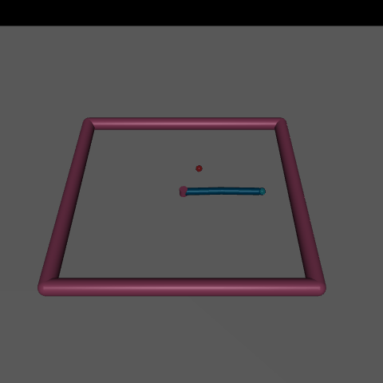
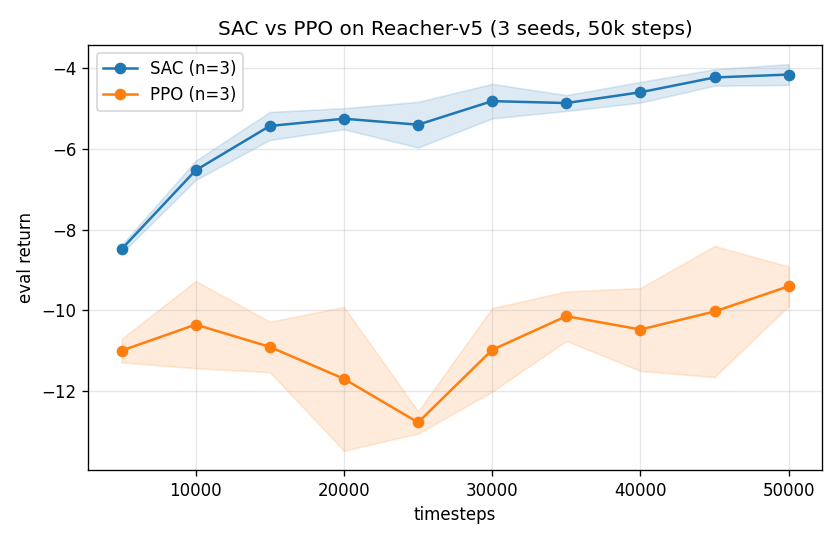

# robotic-arm-trash

Deep RL on a Reacher-style robotic arm (Gymnasium + MuJoCo), built as a portfolio project
with a reproducible experiment harness, multi-seed baselines, and (next) a from-scratch
SAC implementation.



*A SAC agent (blue arm) reaching for the target (red dot) in `Reacher-v5` after 50k steps.*

## Results

SAC and PPO trained on `Reacher-v5` for 50k timesteps, evaluated over 20 episodes per
seed, aggregated across 3 seeds (mean ± std), scored through the same harness as the
random baseline:

| Policy | Seeds | Timesteps | Eval return (mean ± std) | vs random |
|---|---|---|---|---|
| Random | 3 | 50,000 | -43.31 ± 0.18 | — |
| SAC (SB3) | 3 | 50,000 | **-4.16 ± 0.26** | +39.15 |
| PPO (SB3) | 3 | 50,000 | -9.40 ± 0.49 | +33.91 |

SAC reaches Reacher's near-solved band (~-5) and is markedly more sample-efficient than
PPO here — expected for an off-policy method on low-dimensional continuous control.



*Eval return vs timesteps, mean ± std across 3 seeds. All points measured by the project's
own evaluation harness.*

## Requirements

- Python 3.11+
- `uv` for environment management
- A machine able to run Gymnasium's MuJoCo-based `Reacher-v5`

## Quick start

```bash
uv sync
uv run robotic-arm-trash --help
```

## Commands

The `robotic-arm-trash` CLI wraps one shared rollout/eval harness — every policy (random,
SB3, future from-scratch) is scored the same way:

```bash
# Random-policy rollout / baseline
uv run robotic-arm-trash demo  --env Reacher-v5 --steps 1000 --seed 0
uv run robotic-arm-trash eval  --env Reacher-v5 --episodes 20 --seed 0

# Train an agent (saves runs/<id>/{config.json,model.zip,metrics.csv})
uv run robotic-arm-trash train --algo sac --env Reacher-v5 --timesteps 50000 --seed 0

# Score / record / plot a trained checkpoint
uv run robotic-arm-trash eval   --algo sac --model runs/<id>/model.zip --episodes 20
uv run robotic-arm-trash record --algo sac --model runs/<id>/model.zip
uv run robotic-arm-trash plot   --run-dir runs/<id> --out docs/curve.png --label SAC
```

Training logs an eval-return learning curve to `runs/<id>/metrics.csv` every `--eval-freq`
steps (optionally mirrored to TensorBoard via `--tensorboard`).

## Demo scripts

Standalone scripts under `demos/` (random policy):

```bash
uv run python demos/reacher_random_demo.py
uv run python demos/record_reacher_video.py
```

## Tests

```bash
uv run pytest -q              # full suite
uv run pytest -q -m "not slow"  # skip the model-training tests
```

## Project layout & roadmap

The package is organized around one abstraction — *a policy is a callable, a rollout is a
function* — so every agent plugs into the same harness: `rollout`, `evaluation`, `config`,
`seeding`, `metrics`, `plotting`, `experiments`, and the SB3 seam (`sb3`). See
[`ROADMAP.md`](ROADMAP.md) for the phased plan; Phase 2 is a from-scratch PyTorch SAC
validated against these SB3 baselines.

## Notes

- Generated videos (`videos/`) and training runs (`runs/`) are gitignored; committed
  figures/GIFs live in `docs/`.
- On headless machines you may need to configure MuJoCo/OpenGL for rendering.
