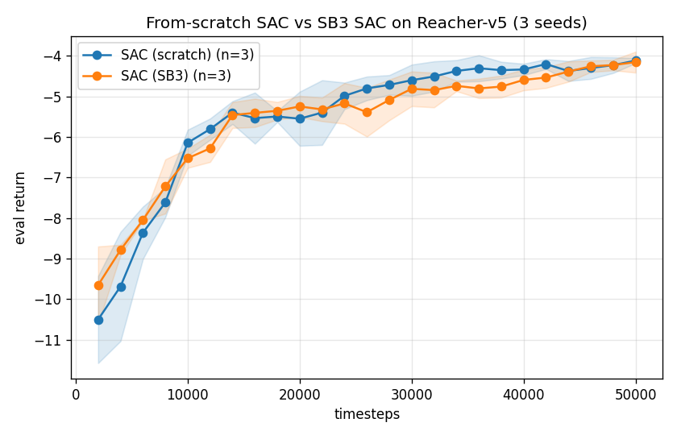

# robotic-arm-trash

Deep RL on a Reacher-style robotic arm (Gymnasium + MuJoCo), built as a portfolio project
with a reproducible experiment harness, multi-seed baselines, and a **from-scratch PyTorch
SAC** validated against the library implementation.


*A SAC agent (blue arm) reaching for the target (red dot) in `Reacher-v5` after 50k steps.*

## Results

Each policy trained on `Reacher-v5` for 50k timesteps, evaluated over 20 episodes per
seed, aggregated across 3 seeds (mean ± std), scored through the same harness as the
random baseline:

| Policy | Seeds | Timesteps | Eval return (mean ± std) | vs random |
|---|---|---|---|---|
| Random | 3 | 50,000 | -43.31 ± 0.18 | — |
| **SAC (scratch, ours)** | 3 | 50,000 | **-4.12 ± 0.06** | +39.19 |
| SAC (SB3) | 3 | 50,000 | -4.16 ± 0.26 | +39.15 |
| PPO (SB3) | 3 | 50,000 | -9.40 ± 0.49 | +33.91 |

SAC reaches Reacher's near-solved band (~-5) and is markedly more sample-efficient than
PPO here — expected for an off-policy method on low-dimensional continuous control.

**The from-scratch PyTorch SAC matches the library implementation within seed variance**
(-4.12 ± 0.06 vs SB3's -4.16 ± 0.26) — Phase 2's validation goal. Both curves track each
other throughout training and converge to the same band:



*From-scratch SAC vs SB3 SAC, eval return vs timesteps, mean ± std across 3 seeds — all
points measured by the project's own evaluation harness. The implementation is in
[`robotic_arm_trash/sac.py`](robotic_arm_trash/sac.py); the derivation tying each loss to
the code is in [`docs/sac.md`](docs/sac.md).*


*SB3 SAC vs PPO sample efficiency, same harness, 3 seeds.*

### Scientific study (Phase 3)

Treating the from-scratch SAC as an object of study — full write-up with all tables and
figures in [`REPORT.md`](REPORT.md), reproducible from seeded configs via
`sweeps/phase3.py` → `sweeps/phase3_report.py`. Highlights:

- **Seed variance (5 seeds × 50k):** final return **-4.16**, 95% Student-t CI
  **[-4.33, -4.00]** — robust to seeding, not a lucky run. *(Tighter estimate than the
  3-seed comparison table above.)*
- **Hyperparameter ablations (3 seeds × 30k):** at a fixed pre-convergence budget, a higher
  learning rate (1e-3) and a *smaller* replay buffer (1e4) both converge faster; network
  width barely matters on this low-dimensional task.
- **Value/policy landscape:** the learned critic is interpretable —

 

*Left: `min(Q₁,Q₂)(s,·)` over the 2-D torque square at a fixed state — smooth, single-peaked,
with the policy action `π(s)` (red star) at the maximum (actor/critic agree). Right:
`V(s)=min Q(s,π(s))` binned by target position — a smooth gradient that recovers the task
geometry, highest where the target sits near the arm's starting fingertip and lowest on the
far side it must swing across.*

## Requirements

- Python 3.11+
- `uv` for environment management
- A machine able to run Gymnasium's MuJoCo-based `Reacher-v5`

## Quick start

```bash
uv sync
uv run robotic-arm-trash --help
```

## Commands

The `robotic-arm-trash` CLI wraps one shared rollout/eval harness — every policy (random,
SB3, from-scratch SAC) is scored the same way:

```bash
# Random-policy rollout / baseline
uv run robotic-arm-trash demo  --env Reacher-v5 --steps 1000 --seed 0
uv run robotic-arm-trash eval  --env Reacher-v5 --episodes 20 --seed 0

# Train an agent (saves runs/<id>/{config.json,model.*,metrics.csv})
# --algo: sac / ppo (stable-baselines3) or sac_scratch (our from-scratch PyTorch SAC)
uv run robotic-arm-trash train --algo sac_scratch --env Reacher-v5 --timesteps 50000 --seed 0

# Score / record / plot a trained checkpoint
uv run robotic-arm-trash eval   --algo sac --model runs/<id>/model.zip --episodes 20
uv run robotic-arm-trash record --algo sac --model runs/<id>/model.zip
uv run robotic-arm-trash plot   --run-dir runs/<id> --out docs/curve.png --label SAC
```

Training logs an eval-return learning curve to `runs/<id>/metrics.csv` every `--eval-freq`
steps (optionally mirrored to TensorBoard via `--tensorboard`). `eval`/`record` also accept
`--algo sac_scratch --model runs/<id>/model.pt` to score the from-scratch agent.

Reproduce the Phase 3 study (idempotent — skips finished runs; `ROBOTIC_ARM_DEVICE=cpu` is
fastest for these small nets):

```bash
ROBOTIC_ARM_DEVICE=cpu python sweeps/phase3.py          # run the sweep (resumable)
python sweeps/phase3_report.py                          # regenerate REPORT.md + docs/phase3_*.png
```

## Demo scripts

Standalone scripts under `demos/` (random policy):

```bash
uv run python demos/reacher_random_demo.py
uv run python demos/record_reacher_video.py
```

## Tests

```bash
uv run pytest -q              # full suite
uv run pytest -q -m "not slow"  # skip the model-training tests
```

## Project layout & roadmap

The package is organized around one abstraction — *a policy is a callable, a rollout is a
function* — so every agent plugs into the same harness: `rollout`, `evaluation`, `config`,
`seeding`, `metrics`, `plotting`, `experiments`, the SB3 seam (`sb3`), the from-scratch
SAC (`sac`), and value/policy-landscape viz (`viz`). See [`ROADMAP.md`](ROADMAP.md) for the
phased plan; the from-scratch PyTorch SAC (Phase 2, ✅) lives in
[`robotic_arm_trash/sac.py`](robotic_arm_trash/sac.py) with its derivation in
[`docs/sac.md`](docs/sac.md). The Phase 3 scientific study — seed-variance CIs,
hyperparameter ablations, SAC-vs-PPO sample efficiency, and learned-value-landscape
interpretation — is written up in [`REPORT.md`](REPORT.md) and reproducible via
`sweeps/phase3.py`.

## Notes

- Generated videos (`videos/`) and training runs (`runs/`) are gitignored; committed
  figures/GIFs live in `docs/`.
- On headless machines you may need to configure MuJoCo/OpenGL for rendering.
