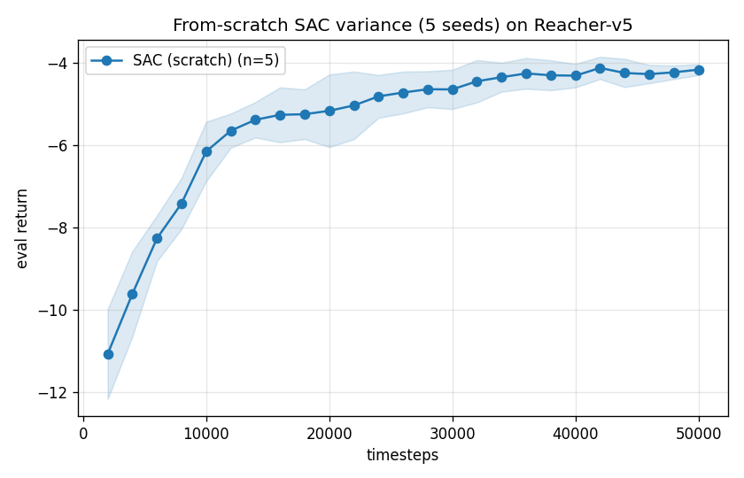
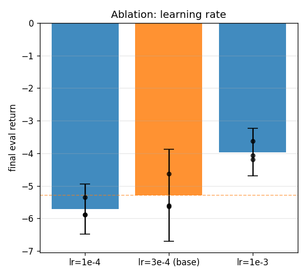
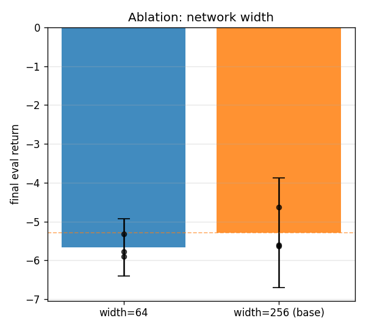
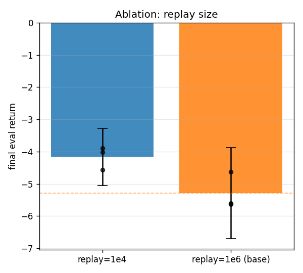
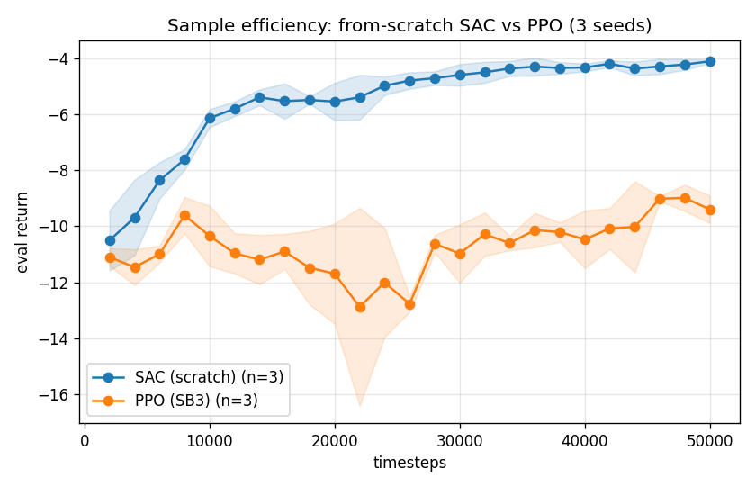
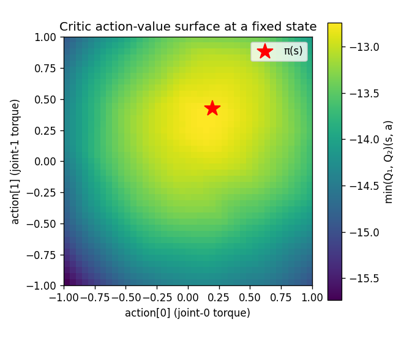
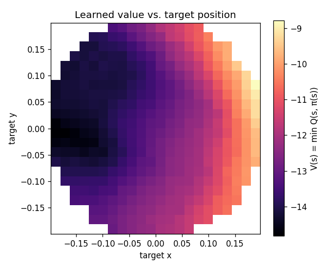

# Phase 3 — Scientific Study

Treating the from-scratch SAC (Phase 2) as an object of study: seed-variance with confidence intervals, hyperparameter ablations, a sample-efficiency comparison against PPO, and an interpretation of the learned value/policy landscape. Every number regenerates from a seeded config via `sweeps/phase3.py` → `sweeps/phase3_report.py`; training runs live under the gitignored `runs/`.

## 1. Seed-variance study

From-scratch SAC, 5 seeds × 50,000 steps, final eval return scored over 20 episodes/seed through the shared harness.

| Policy | Seeds | Timesteps | Final eval return (mean) | 95% CI |
|---|---|---|---|---|
| SAC (scratch) | 5 | 50,000 | -4.16 | [-4.33, -4.00] |

Mean final return **-4.16** with a 95% t-CI of **[-4.33, -4.00]** (σ across seeds = 0.13). The interval is tight relative to the +39 improvement over random, i.e. the result is robust to seeding rather than a lucky run. *(n=5; CI is a small-sample t-interval.)*

## 2. Hyperparameter ablations

Each arm: from-scratch SAC, 3 seeds × 30,000 steps, varying one hyperparameter off the validated baseline (lr 3e-4, width 256, replay 1e6 — the orange bar). **30k is deliberately short of convergence** (the baseline reaches -5.29 here vs −4.16 at 50k), which is exactly what makes these ablations informative: they probe *learning speed*, i.e. how quickly each setting gets the agent toward the solved band within a fixed budget. With n=3 the 95% t-CIs are wide (t₃≈4.30), so the black dots show the individual seeds — the trends are read from per-seed consistency, not the intervals alone.

### Learning rate

| Arm | Seeds | Timesteps | Final eval return (mean) | 95% CI |
|---|---|---|---|---|
| lr=1e-4 | 3 | 30,000 | -5.71 | [-6.48, -4.94] |
| lr=3e-4 (base) | 3 | 30,000 | -5.29 | [-6.70, -3.88] |
| lr=1e-3 | 3 | 30,000 | -3.96 | [-4.70, -3.23] |

**Higher learning rate learns faster here.** All three lr=1e-3 seeds (~−4.0) beat every baseline seed, while lr=1e-4 is consistently slower (~−5.7) — too small a step to converge within 30k. The effect is monotonic and per-seed consistent. This is a *speed* difference: by 50k the baseline lr closes most of the gap (§1).

### Network width

| Arm | Seeds | Timesteps | Final eval return (mean) | 95% CI |
|---|---|---|---|---|
| width=64 | 3 | 30,000 | -5.66 | [-6.41, -4.92] |
| width=256 (base) | 3 | 30,000 | -5.29 | [-6.70, -3.88] |

**Width barely matters.** A 64-unit net (~−5.7) trails the 256-unit baseline only slightly and the seed clouds overlap — unsurprising for a 10-D observation / 2-D action task where capacity isn't the bottleneck.

### Replay buffer size

| Arm | Seeds | Timesteps | Final eval return (mean) | 95% CI |
|---|---|---|---|---|
| replay=1e4 | 3 | 30,000 | -4.16 | [-5.05, -3.28] |
| replay=1e6 (base) | 3 | 30,000 | -5.29 | [-6.70, -3.88] |

**A smaller replay buffer helps at this horizon.** replay=1e4 (~−4.2) beats the 1e6 baseline (~−5.3). With only 30k steps a 1e6 buffer never recycles, so it stays diluted with stale early-exploration transitions; a 1e4 buffer keeps training on recent, on-distribution data and converges faster — a concrete instance of the off-policy staleness trade-off.

## 3. Sample efficiency — SAC vs PPO

Both 3 seeds × 50,000 steps, same harness.

| Policy | Seeds | Timesteps | Final eval return (mean) | 95% CI |
|---|---|---|---|---|
| SAC (scratch) | 3 | 50,000 | -4.12 | [-4.28, -3.96] |
| PPO (SB3) | 3 | 50,000 | -9.40 | [-10.62, -8.19] |

SAC reaches **-4.12** vs PPO's **-9.40** at 50k. The curves show SAC climbing far earlier — the expected off-policy sample-efficiency edge on low-dimensional continuous control, since SAC reuses every transition from the replay buffer many times while PPO discards each batch after a few epochs.

## 4. Value/policy landscape (the physicist's edge)

Peeking inside the learned functions of a trained checkpoint (no extra training).

**Critic action-value surface.** At a fixed state, `min(Q₁,Q₂)(s,·)` over the 2-D torque square. The surface is smooth and single-peaked, and the policy's action `π(s)` (red star) sits at/near the maximum — the actor and critic agree, which is exactly what a converged SAC should show.

**Value vs. target position.** `V(s)=min Q(s,π(s))` binned by target location, sampled over environment resets (the arm starts near its rest pose, fingertip ≈ (0.21, 0)). Rather than a symmetric bowl, the value forms a smooth **spatial gradient**: highest for targets on the +x side — near where the fingertip already begins — and lowest for targets on the far −x side, which require swinging the whole arm across the workspace and so accumulate more negative distance over the 50-step episode (reward = −distance − control cost). The critic has recovered the task geometry *including the asymmetry induced by the arm's initial configuration*, purely from learned values.

## Takeaways

- The from-scratch SAC is **robust to seeding** (5-seed 95% CI [-4.33, -4.00]), not a lucky single run.
- At a fixed short budget, **learning speed is dominated by step size and replay freshness**: a higher learning rate and a *smaller* replay buffer both reach the solved band faster; network width is largely irrelevant on this low-dimensional task.
- **SAC is far more sample-efficient than PPO** here (-4.12 vs -9.40 at 50k), the expected off-policy advantage.
- The learned **critic is interpretable**: a smooth single-peaked action-value surface with the policy at its max, and a value field that recovers the task's spatial geometry — including the asymmetry from the arm's start pose.

*Reproduce: `python sweeps/phase3.py` (idempotent) then `python sweeps/phase3_report.py`. Caveat: ablations use n=3 seeds, so per-seed consistency carries the conclusions rather than the wide small-sample CIs.*
